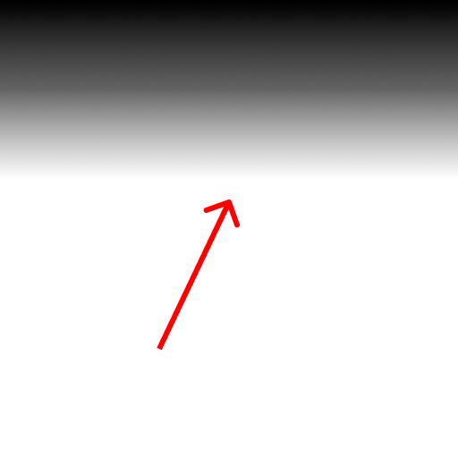

# SmoothGradient

A SwiftUI framework for creating smooth gradients using easing functions.

## Motivation

Linear gradients tend to produce hard edges, which are more noticeable when transitioning between highly contrasting colors. This framework provides a simple way to create smoother gradients using easing functions.

| Linear | Smooth |
| --- | --- |
|  |  |


## Installation

### Swift Package Manager

Add the following to your `Package.swift` file:

```swift
.package(url: "https://github.com/raymondjavaxx/SmoothGradient.git", from: "1.0.0")
```

To add from Xcode, go to *File* -> *Add Package Dependencies...* and enter the URL above.

### CocoaPods

Add the following to your `Podfile`:

```ruby
pod 'SmoothGradient', '~> 1.0.0'
```

## Usage

### Pre-iOS 17/Pre-macOS 14

```swift
import SmoothGradient

struct ContentView: View {
    var body: some View {
        LinearGradient(
            gradient: .smooth(from: .black, to: .white, curve: .easeInOut), // ⬅️
            startPoint: .top,
            endPoint: .bottom
        )
    }
}
```

## iOS 17+/macOS 14+

```swift
import SmoothGradient

struct ContentView: View {
    var body: some View {
        SmoothLinearGradient( // ⬅️
            from: .black,
            to: .white,
            startPoint: .top,
            endPoint: .bottom,
            curve: .easeInOut
        )
    }
}
```

## License

SmoothGradient is available under the MIT license. See the [LICENSE](LICENSE) file for more info.
